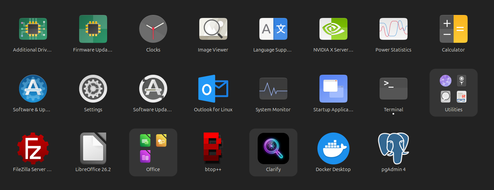
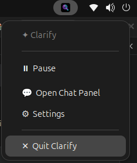
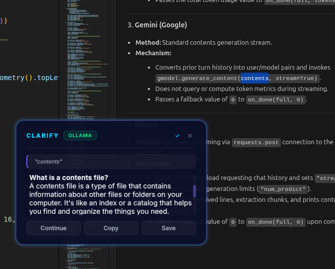
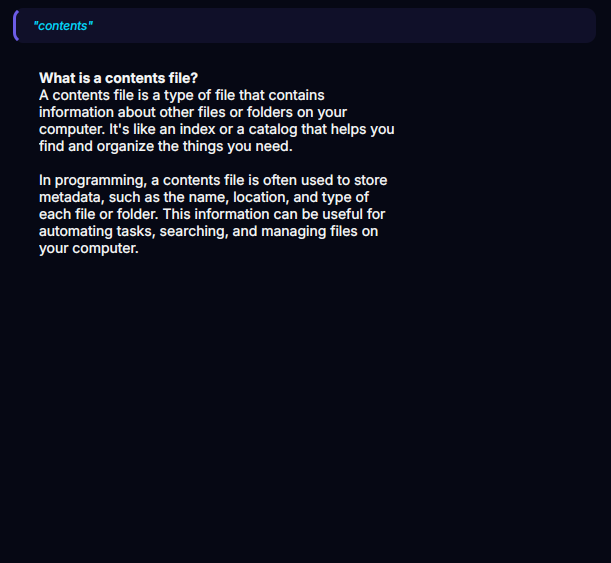
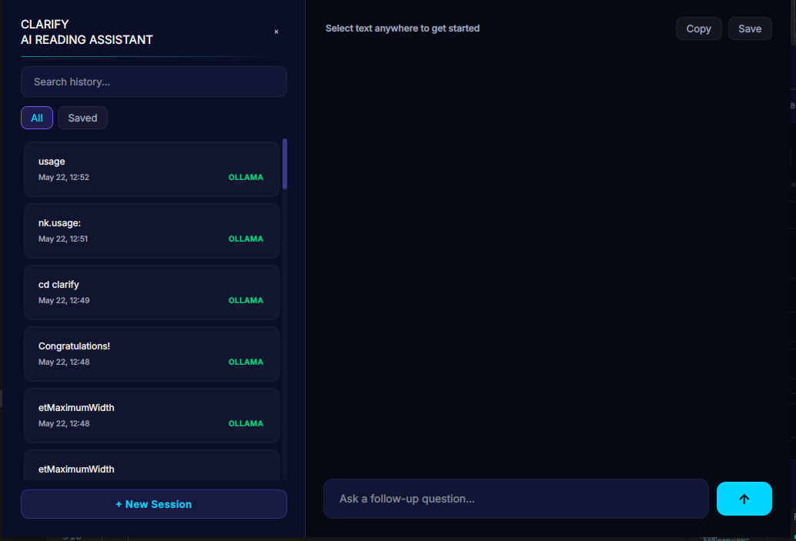
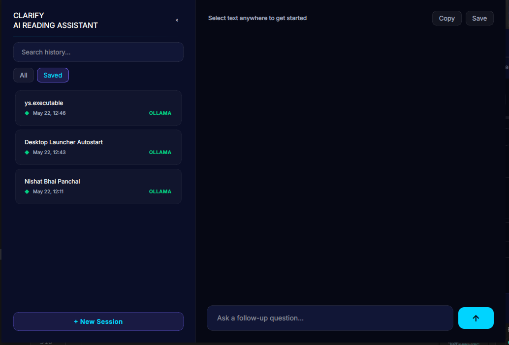
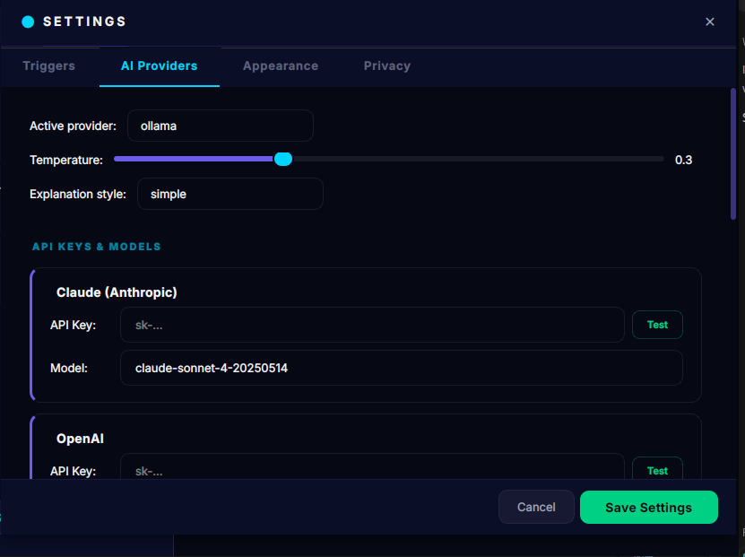
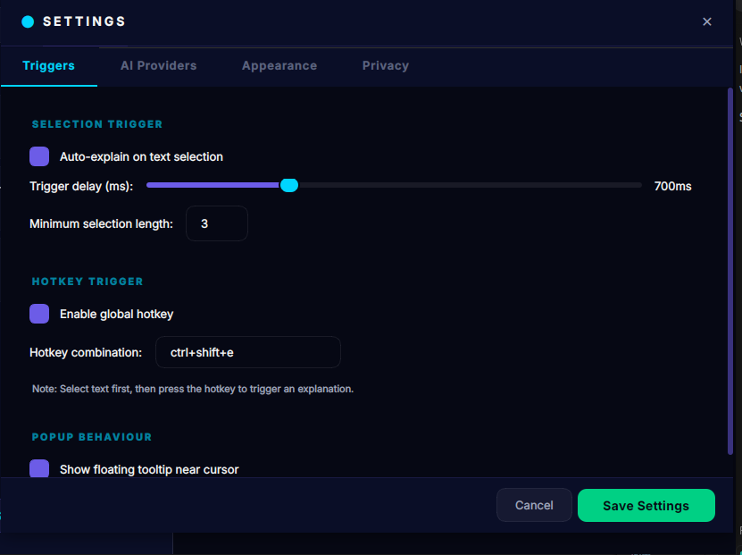

# ✦ Clarify — AI Text Explainer for Ubuntu

> Select any text, anywhere. Get an instant AI explanation.

---

## Core Use Case (How it works)

Imagine you are reading a technical blog post, a block of code, a command-line tutorial, or a dense document:
1. **Highlight the text** you do not understand (e.g., a complex line of code or terminal command).
2. **Wait ~700ms** (or press the global hotkey **Ctrl+Shift+E**).
3. **An explanation tooltip** instantly pops up right next to your mouse cursor.
4. Need to dive deeper? Click **Continue** to open the chat panel and talk directly with the AI about that highlighted context.

No more copy-pasting, switching to a web browser, opening AI websites, and manually writing "explain this".

---

## Features

- **Global text selection monitor** — watches X11 PRIMARY selection
- **Glassmorphism popup** — smooth frosted-glass tooltip near your cursor
- **Full chat panel** — follow-up conversations per explanation
- **History sidebar** — searchable, bookmarkable explanation history
- **6 AI providers** — Claude, OpenAI, Gemini, Groq, Ollama (local), OpenRouter
- **System tray** — always running, zero friction
- **Dual trigger modes** — auto on select + manual hotkey (Ctrl+Shift+E)
- **All content types** — code, legal, medical, scientific, anything

---

## Requirements

- Ubuntu 20.04+ (or any Debian-based distro with X11)
- Python 3.10+
- xclip or xsel
- xdotool

---

## Installation

```bash
bash install.sh
```

Then run:
```bash
./run.sh
```

---

## First-time Setup

1. Clarify starts and appears as **T** icon in your system tray
2. Right-click tray → **Settings** → **AI Providers** tab
3. Enter your API key for your preferred provider
4. Click **Test** to verify, then **Save Settings**
5. Highlight any text anywhere — the explanation popup appears!

---

## Usage

### Auto Mode (default)
Highlight any text → wait ~700ms → popup appears automatically

### Hotkey Mode
Highlight text → press **Ctrl+Shift+E** → popup appears

### Both modes can be toggled in Settings → Triggers

### Popup Actions
- **Chat More** — open full chat panel for follow-up questions
- **Copy** — copy explanation to clipboard
- **Save** — bookmark this explanation
- **✕** — close popup (or click away)

### Chat Panel
- Left sidebar: full history, searchable
- Right: conversation thread with AI
- Type follow-up questions, press **Ctrl+Enter** to send
- Filter by bookmarked explanations

---

## Visual Tour & Interface Analyses

### 1. System Integration

* **Application Launcher:** Launch Clarify directly from the Ubuntu apps grid.
  

* **System Dock:** View the active running indicator on the Ubuntu system dock.
  

* **System Tray Icon:** Clarify runs quietly in the background, represented by the magnifying glass icon in the top-bar system tray.
  

* **System Tray Menu:** Right-click the tray icon to quickly pause selection monitoring, open the chat panel, configure settings, or exit the app.
  

### 2. Core Workflow & Dialogs

* **Interactive Floating Tooltip:** Highlighting any text prompts a glassmorphic tooltip near your cursor with a live AI explanation, offering Continue (Chat), Copy, and Bookmark (Save) options.
  

* **Detailed Explanation View:** Read explanations in a high-resolution, scrollable chat bubble layout.
  

### 3. Chat Panel & History

* **Main Chat Workspace:** A dedicated workspace to ask follow-up questions, start new conversation sessions, and view explanation histories.
  

* **Bookmarked Filter:** Toggle history list items to display only saved/bookmarked explanations.
  

### 4. Configuration Controls

* **AI Providers Settings:** Toggle active AI providers (Claude, OpenAI, Gemini, Groq, Ollama, OpenRouter), adjust temperature parameters, select explanation styles, or update credentials.
  

* **Trigger Settings:** Configure automatic text-selection triggers (with custom delays and lengths) or choose global X11 keybindings.
  

---

## AI Providers

| Provider | Notes |
|---|---|
| **Claude** (Anthropic) | Best for complex explanations |
| **OpenAI** | GPT-4o, reliable |
| **Gemini** | Google, fast |
| **Groq** | Ultra-fast inference |
| **Ollama** | Local/offline, no API key needed |
| **OpenRouter** | Access many models with one key |

---

## Architecture

```text
 ┌─────────────────┐       ┌─────────────────┐       ┌─────────────────┐
 │   X11 Primary   │       │   Global Hotkey │       │   System Tray   │
 │   Selection     │       │   (pynput/X11)  │       │   (PyQt6 Icon)  │
 └───────┬─────────┘       └───────┬─────────┘       └────────┬────────┘
         │                         │                          │
         ▼                         ▼                          │
 ┌────────────────────────────────────────────────────────┐   │
 │                  main.py (Orchestrator)                │◄──┘
 │         Event Loop & Inter-Thread Signal Bridge        │
 └───────────────────────┬────────────────────────────────┘
                         │
      ┌──────────────────┼──────────────────┐
      ▼                  ▼                  ▼
┌────────────┐     ┌────────────┐     ┌────────────┐
│   Glass    │     │ Full Chat  │     │  Settings  │
│   Popup    │     │   Panel    │     │   Window   │
│ (Tooltip)  │     │ (History)  │     │ (Configs)  │
└─────┬──────┘     └─────┬──────┘     └─────┬──────┘
      │                  │                  │
      └─────────┬────────┘                  │
                ▼                           ▼
      ┌──────────────────┐        ┌──────────────────┐
      │     AI Router    │        │  SQLite Database │
      │ (Multi-Provider) │        │  (SQLAlchemy)    │
      └─────────┬────────┘        └──────────────────┘
                ▼
      ┌──────────────────┐
      │ Cloud LLMs & APIs│
      │  Local Ollama    │
      └──────────────────┘
```

---

## Project Structure

```
clarify/
├── main.py              # App entry point + orchestrator
├── config/
│   └── settings.py      # Pydantic settings model
├── core/
│   ├── ai_router.py     # Multi-provider AI routing
│   └── crypto.py        # API key encryption
├── db/
│   └── database.py      # SQLite + SQLAlchemy models
├── platform/
│   ├── linux.py         # X11 selection monitor
│   └── hotkey.py        # Global hotkey manager
├── ui/
│   ├── tray.py          # System tray icon
│   ├── tooltip_popup.py # Glassmorphism popup
│   ├── chat_panel.py    # Full chat history panel
│   └── settings_window.py # Settings UI
└── requirements.txt
```

---

## Data & Privacy

- All data stored **locally** in SQLite (`~/.local/share/Clarify/`)
- API keys encrypted with Fernet (AES-128-CBC) using a machine-derived key
- No telemetry, no cloud sync
- Clear history anytime: Settings → Privacy → Clear All History

---

## Troubleshooting

**Popup doesn't appear?**
- Check: `xclip` and `xdotool` are installed
- Try running from terminal to see error output: `./run.sh`
- Check Settings → Triggers → auto-select is enabled

**Hotkey not working?**
- Try running with sudo for first hotkey registration (some DEs need it)
- Change hotkey combo in Settings if there's a conflict

**"No API key" error?**
- Go to Settings → AI Providers → enter your key → Save

**Qt platform error?**
- Run: `export QT_QPA_PLATFORM=xcb && ./run.sh`

---

## License

MIT — use freely, build upon it.
